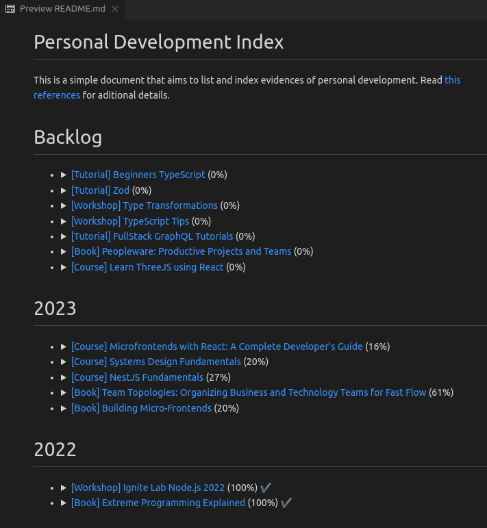
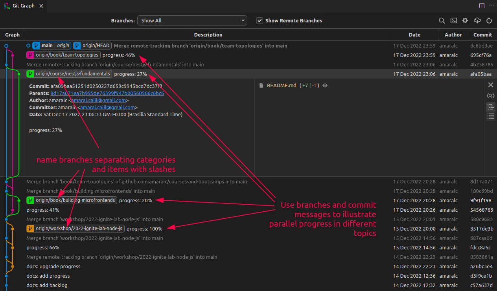
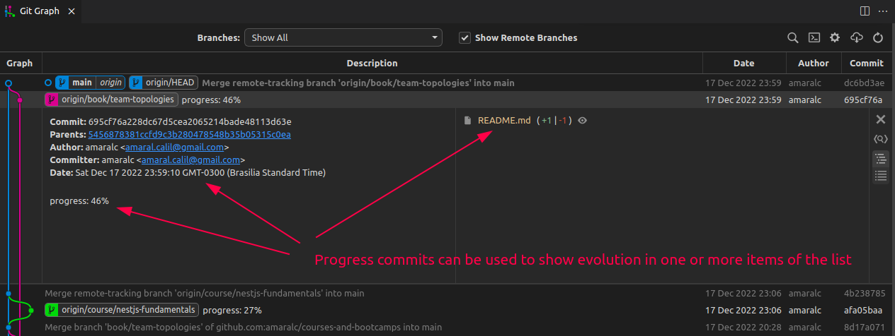
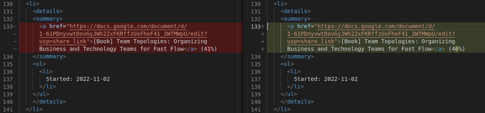

# References

This repository is an on going experiment, in search of a simple way to document and visualize personal development progress. 

 

## Summary of Progress

The [README.md](../README.md) summarizes the latest progress for every topic. 

 

Image 1 - Latest progress

 

## Branches and parallel progress

The commit history in Image 2 shows parallel progress in different topics indexed in [README.md](../README.md). The image was taken using [this repository](https://github.com/amaralc/courses-and-bootcamps) as reference.

Use a standardized way of naming branches, using lower case and separating category and item title with a slash in the branch name.

Ex.: 

- `book/team-topologies`
- `workshop/ignite-lab-node-js`
- `course/nest-js-fundamentals`

 

Image 2 - Visualizing parallel progress with standardize branch names and commit messages

 

## Progress commits

Commits can be used to update progress in the `README.md` file. Commit messages can also be stadardized, using lower case and prefixes such as `docs`, `progress` and others of your choice.

Ex.:

- `progress: 37%`
- `docs: add new book in backlog`

 

Image 3 - Progress commits

 

 

Image 4 - Progress commit details

 

